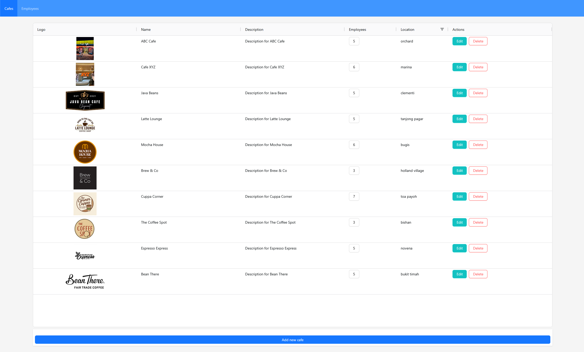

# cafe-employee-app

App that allows user to manage Cafes & Employees.



URL of website is [here](https://cafe-employee-app-frontend.onrender.com).

Note: The app is deployed using Render's Free Plan, so start up will take some time.

# How to Run App Locally

## Option 1:

***Requirements***

- Have latest [docker](https://docs.docker.com/get-started/get-docker/)
- Have latest [docker-compose](https://docs.docker.com/compose/install/)

1. Clone this repository in your local machine.

    ```
    git clone <repository-url>

    cd cafe-employee-app
    ```

    The  `cafe-employee-app` folder will be project root directory.

2. Setup `.env` files.

- Project root(./.env) - for Postgres DB:

    ```
    POSTGRES_USER=postgres
    POSTGRES_PASSWORD=postgres
    POSTGRES_DATABASE=postgres
    ```
- Backend (./backend/src/.env) – for database connection:

    ```
    PG_HOST=db
    PG_PORT=5432
    PG_USER=postgres
    PG_PASSWORD=postgres
    PG_DATABASE=postgres
    DATABASE_URL=postgresql://postgres:postgres@db:5432/postgres
    ```

- Frontend (./frontend/.env) – for node server connection:
    
    ```
    VITE_API_URL=http://localhost:3000
    ```

3. In `./frontend`, **delete** `.env.production` file. (As it is needed for deployment, but has environment varible conflicts when running docker container locally.)

4. Run the app.
    
    ```
    docker-compose up --build
    ```

5. Access the webpage locally: Open your browser at: [http://localhost:5173/](http://localhost:5173/)

6. Stopping the app.
    
    ```
    docker-compose down
    ```

## Option 2:

1. Perform Steps 1-3 in instructions [Option 1](#option-1).

2. Build and run the frontend

    With currennt directory as project directory, run:

    ```
    cd frontend
    npm install
    npm run build
    ```

3. Run the backend

    Open new terminal with currennt directory as project directory, run:

    ```
    cd backend/src
    node app.jsx
    ```

4. Setup PostgreSQL database
    
    - Create a database in PostgreSQL/pgAdmin.
    
    - Fill in the .env file in `./backend/src/.env` with your database credentials.

    - Copy [init.sql](./init.sql) and run it in the query tool (pgAdmin) or via the PostgreSQL command line to initialize tables.

5. Access the app.

    Open your browser at [http://localhost:5173/](http://localhost:5173/) (default) or use the URL shown in the terminal from Step 2.

## Documentation

1. [Frontend](./frontend/README.md)

2. [Backend](./backend/README.md)

3. [Database / Miscellaneous documentation](./docs/)