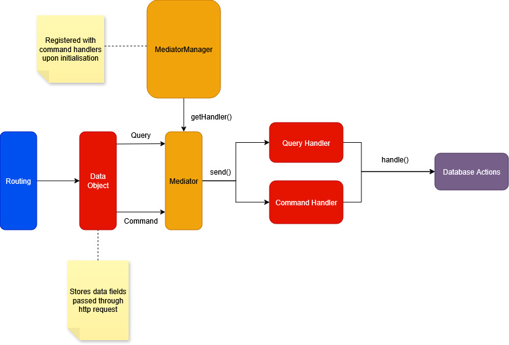

## Backend

This backend follows the **CQRS (Command Query Responsibility Segregation)** and **Mediator** pattern architecture for clean separation of concerns and maintainability.

### Architecture Overview

- **Routing:** Handles incoming HTTP requests and creates Command or Query objects.
- **Data Objects:** Encapsulate the request data.
- **Mediator:** Send commands or queries to appropriate handlers.
- **Handlers (Query Handler / Command Handler):** Perform database actions.
- **MediatorManager:** Registers handlers and resolves them at runtime.
    - Obeys Singleton design pattern by only having one object instance of `MediatorManager` upon initialisation of node server.

## Routes

### GET Routes (Queries)

| Method | Endpoint | Query Params | Description |
|--------|----------|--------------|-------------|
| `GET` | `/cafes` | `location` (optional) | Returns a list of cafes, optionally filtered by location. Sorted by number of employees (highest first). |
| `GET` | `/employees` | `cafe` (optional) | Returns a list of employees, optionally filtered by cafe. Sorted by `days_worked` (highest first). |

### POST Routes (Queries)

| Method | Endpoint | Body | Description |
|--------|----------|--------------|-------------|
| `POST` | `/cafes` | `{ name, description, logo, location }` | Creates a new cafe. |
| `POST` | `/employees` | `{ name, emailAddress, phoneNumber, gender, cafeId }` | Creates a new employee. |
| `POST` | `/upload` | `image_file` | Uploads a cafe logo image. Returns a URL to the uploaded file. |

### PUT Routes (Queries)

| Method | Endpoint | Body | Description |
|--------|----------|--------------|-------------|
| `PUT` | `/cafes` | `{ cafeId, name, description, logo, location }` | Updates details of an existing cafe. |
| `PUT` | `/employees` | `{ employeeId, name, emailAddress, phoneNumber, gender, newCafeId, start_date }` | Updates an existing employee's details and cafe assignment. |

### DELETE Routes (Queries)

| Method | Endpoint | Body | Description |
|--------|----------|--------------|-------------|
| `DELETE` | `/cafes` | `{ cafeId }` | Deletes a cafe and all employees under it. |
| `DELETE` | `/employees` | `{ employeeId }` | Deletes an employee from the database. |

### Notes

- Validation: All input is validated at both API and database level.
- In `models`, `Cafe` and `Employee` classes contains methods to validate data and check whether IDs are present in database.
 

## Technologies Used

- Express.js
- dayjs
- multer
- pg
- pg-promise